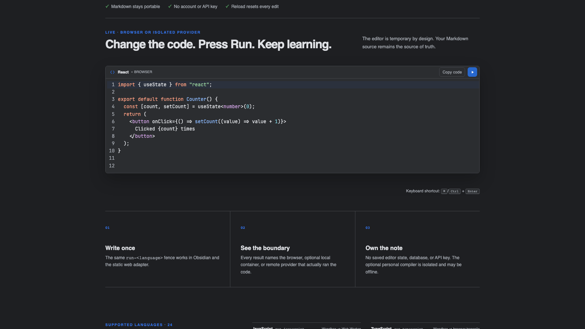
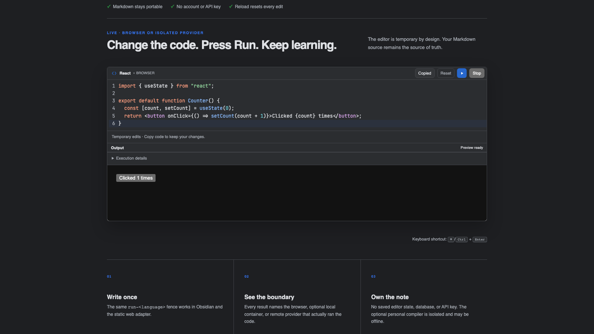
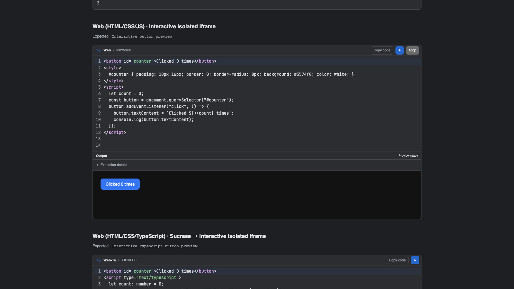

# Runnable Code Blocks

<p align="center">
  <a href="https://github.com/woonyong-kr/obsidian-runnable-code-blocks/releases/latest"></a>
  <a href="https://github.com/woonyong-kr/obsidian-runnable-code-blocks/actions/workflows/ci.yml"></a>
  <a href="https://github.com/woonyong-kr/obsidian-runnable-code-blocks/releases/latest"></a>
  <a href="LICENSE"></a>
</p>

<p align="center">
  <strong>Run code where you learn.</strong><br />
  Turn Markdown examples into temporary, theme-aware editors in Obsidian and static websites.
</p>

<p align="center">
  <a href="https://github.com/woonyong-kr/obsidian-runnable-code-blocks/releases/latest">Install from a release</a>
  ·
  <a href="https://woonyong-kr.github.io/obsidian-runnable-code-blocks/">Try the live editor</a>
  ·
  <a href="https://community.obsidian.md/plugins/runnable-code-blocks">View the Community page</a>
</p>



Captured from the current browser adapter in Chromium on September 8, 2026. This demonstrates the shared editor and execution UI; it is not an Obsidian runtime recording.



Runnable Code Blocks keeps the explanation, the experiment, and the result in one note. Readers edit a temporary copy, press **Run**, and see exactly which browser, isolated container, or named public provider produced the output; the Markdown source stays portable and unchanged.

- **24 exact runnable fences** — 21 programming languages plus interactive JavaScript, TypeScript, and React documents.
- **Graceful provider fallback** — browser-native runners work immediately; prepared container languages can use a private localhost companion or an explicitly configured personal compiler before named public providers.
- **Portable Markdown** — the document stores ordinary `run-<language>` fences instead of plugin-specific state.
- **Keep a useful change** — edit and run a temporary copy, then use **Copy code** to keep it. **Reset** or reopening the rendered note restores the Markdown source.
- **Readable results** — see the outcome first; expand **Execution details** for timing and the provider that ran the code.

## At a glance

| What you need | What the plugin does |
| --- | --- |
| Learn beside an explanation | Replaces `run-<language>` fences with temporary editable runners in Reading view |
| Keep Markdown portable | Stores only ordinary fenced code in the note; editor state and output are disposable |
| Avoid provider-only outages | Uses seven browser-native fences, optional isolated containers, and named public providers behind one fallback contract |
| Publish the same lesson | Shares the parser, catalog, runner composition, editor, and output UI with the static adapter |
| Understand the trust boundary | Labels the selected provider before execution and keeps remote execution configurable |

## Try it in 60 seconds

1. Install from the latest GitHub release: copy `main.js`, `manifest.json`, and `styles.css` into `.obsidian/plugins/runnable-code-blocks/`, reload Obsidian, then enable the plugin. Community listing is pending; use the [live editor](https://woonyong-kr.github.io/obsidian-runnable-code-blocks/) for an installation-free trial.
2. Paste this browser-only example into a note:

````markdown
```run-javascript
console.log("Hello from Obsidian!");
```
````

3. Open Reading view and select **Run**, or press <kbd>⌘</kbd>/<kbd>Ctrl</kbd> + <kbd>Enter</kbd> inside the editor.

The output appears directly beneath the code. **Reset** restores the current Markdown source; closing and reopening the rendered note discards its temporary edits.

For a clickable browser component, keep HTML, CSS, and JavaScript together in `run-web`:

````markdown
```run-web
<button id="counter">Clicked 0 times</button>
<script>
  let count = 0;
  const button = document.querySelector("#counter");
  button.addEventListener("click", () => {
    button.textContent = `Clicked ${++count} times`;
    console.log(button.textContent);
  });
</script>
```
````

Use `run-web-ts` and `<script type="text/typescript">` for the same component with TypeScript. Plain `run-typescript` remains an isolated console program, so existing notes do not silently gain DOM access.

For a React documentation-style component, use one self-contained JSX or TSX module:

````markdown
```run-react
import { useState } from "react";

export default function Counter() {
  const [count, setCount] = useState<number>(0);

  return (
    <button onClick={() => setCount((value) => value + 1)}>
      Clicked {count} times
    </button>
  );
}
```
````

`run-react` bundles React and ReactDOM with the plugin, accepts JSX and TSX in the same fence, automatically mounts the default component, and preserves the same Run, Console, error, Reset, and sandbox behavior. React and `react-dom/client` imports are available; arbitrary packages and relative multi-file imports are intentionally rejected so the note remains deterministic and server-free.

## What happens when you press Run

1. The exact fence chooses one entry from the shared language catalog.
2. The configured provider order selects a browser-native, local container, or remote adapter.
3. A preflight checks whether execution can start and the header names the selected environment.
4. The editor sends only the current temporary source to that adapter.
5. Output, errors, duration, and provider details appear inline without modifying the note.
6. Fallback is allowed only when the first adapter proves that execution never started.

This last rule avoids running the same program twice after a timeout or an unknown remote result.

## Where it helps

- Build programming notes that can be read and practiced in the same place.
- Turn tutorials and interview material into executable examples.
- Let readers experiment without copying every snippet into a separate IDE.
- Publish the same runnable Markdown through a static website adapter.

The UI follows the active Obsidian theme through semantic interface and `--code-*` tokens: line numbers, a compact Run action, named provider status, and inline Output. Static hosts use the same component and runner code while supplying only their own theme variables. Editors grow through 100 source lines plus two numbered editing lines before their own scrollbar appears.



## Supported languages

Version 0.7.0 defines the following stable fences. “Local” means the optional desktop companion can execute it after its image is explicitly prepared. “Personal compiler” means a static-site owner explicitly configured a separate HTTPS gateway; “Remote” means source is sent to the named public provider.

| Fence | Browser/static runtime | Optional local runner |
| --- | --- | --- |
| `run-javascript` | Wandbox → Web Worker | — |
| `run-typescript` | Wandbox → browser transpile | — |
| `run-python` | Wandbox | Python container |
| `run-sql` | Wandbox | SQLite container |
| `run-html` | Sandboxed preview iframe | — |
| `run-css` | Sandboxed preview iframe | — |
| `run-web` | Terminable Worker + sandboxed DOM bridge | — |
| `run-web-ts` | Sucrase → Worker + sandboxed DOM bridge | — |
| `run-react` | React + Sucrase → Worker + sandboxed DOM bridge | — |
| `run-kotlin` | Kotlin Playground | Kotlin/JVM container |
| `run-java` | Wandbox | Java container |
| `run-c` | Wandbox | GCC container |
| `run-cpp` | Wandbox | GCC container |
| `run-go` | Wandbox | Go container |
| `run-rust` | Wandbox | Rust container |
| `run-csharp` | Wandbox | .NET SDK container |
| `run-swift` | SwiftFiddle | Swift container |
| `run-ruby` | Wandbox | Ruby container |
| `run-php` | Wandbox | PHP container |
| `run-r` | Wandbox | R container |
| `run-scala` | Wandbox | — |
| `run-dart` | DartPad compile → isolated frame | Dart container |
| `run-lua` | Wandbox | Lua container |
| `run-shell` | Wandbox | Alpine `sh` container |

## Execution and privacy

Code runs only after **Run** or the keyboard shortcut. Treat every runnable block as executable code.

- Remote execution is enabled, while private-first is the default for new Obsidian installs. Browser-native execution is used first, then an enabled local companion, then a remote provider.
- Existing settings that explicitly chose remote-first keep that order. Remote execution can be disabled without disabling browser or local execution.
- JavaScript and transpiled TypeScript run in a fresh disposable Web Worker with a five-second timeout. Common direct network globals are shadowed, but the Worker is a lifecycle boundary rather than a security sandbox; run only code you trust.
- HTML and CSS render in an opaque sandboxed iframe. Their authored scripts remain blocked by a restrictive Content Security Policy; only the nonce-bound internal height reporter can run so the result can expand without an internal scrollbar. CSS is applied to a reusable card, button, and text specimen.
- Interactive `run-web` documents run inline JavaScript in a dedicated Worker and render HTML/CSS through a restricted DOM bridge in a fresh opaque-origin iframe. `run-web-ts` transpiles `<script type="text/typescript">` blocks before using the same sandbox.
- `run-react` transpiles a self-contained JSX or TSX module with Sucrase and mounts its default export with bundled React and ReactDOM. Only `react`, `react-dom`, and `react-dom/client` imports are available; no package is downloaded while running a note.
- All interactive previews block Fetch/XHR/WebSocket calls, subresource loading, forms, popups, top navigation, objects, and same-origin access. A per-run token authenticates every relayed message, the outer frame enforces the same output cap independently, and both frame layers use a no-referrer policy.
- **Stop** terminates the interactive preview Worker. A heartbeat watchdog also stops unresponsive code, including infinite loops, so you can edit and run again. The DOM bridge supports a restricted subset of browser APIs; arbitrary DOM libraries, canvas, and external scripts are not supported.
- For compatible local companions and personal compilers, **Stop** requests server cancellation and waits for cleanup acknowledgement. An unknown cleanup result is not shown as confirmed cancellation.
- Kotlin Playground, Wandbox, SwiftFiddle, and DartPad receive source only when their adapter is selected.
- The Community Plugin does not access the filesystem, spawn local processes, install runtimes, or modify `PATH`. The optional companion is a separately installed release asset and uses only the local container engine.

A fallback occurs only when execution is known not to have started. Compilation errors, program failures, timeouts with an unknown remote outcome, and non-zero exits never cause the same code to run again through another provider. See [runtime provider architecture](docs/runtime-providers.md) for the full contract.

## Settings

Open **Settings → Community plugins → Runnable Code Blocks**:

- **Local runner** — opt into the separately installed desktop companion.
- **Local runner endpoint** — accepts only `http://127.0.0.1` or `http://localhost`.
- **Pairing token** — stored in Obsidian SecretStorage rather than plugin data.
- **Remote execution** — allow or block source submission to named providers.
- **Provider order** — choose Browser/local → Remote or Remote → Browser/local.
- **Supported languages** — inspect the complete runtime map from the same catalog used by the plugin.

## Optional local runner

The local runner is useful when a public provider is unavailable or source should remain on the desktop. It requires Node.js 22 and a running Docker-compatible engine. Download `runnable-code-blocks-local-runner.mjs` from the matching GitHub release, then prepare only the languages you need:

```bash
node runnable-code-blocks-local-runner.mjs list
node runnable-code-blocks-local-runner.mjs prepare kotlin java cpp
node runnable-code-blocks-local-runner.mjs start
```

Copy the printed token into the plugin settings and enable **Local runner**. The service binds only to `127.0.0.1`; it is not a public backend and must never be exposed through port forwarding or a reverse proxy. Full setup, isolation controls, image references, and troubleshooting are documented in [Local runner](local-runner/README.md).

## Troubleshooting

- **Run is unavailable:** hover or focus the status text to see which provider preflight failed. Public providers can be temporarily unavailable.
- **Only seven fences work after disabling remote execution:** this is expected. JavaScript, TypeScript, HTML, CSS, Web, Web TypeScript, and React are browser-native.
- **A React import is rejected:** `run-react` deliberately includes only React and ReactDOM. Keep the example self-contained instead of importing arbitrary npm or relative modules.
- **Edits disappeared after Reset or reopening the note:** this is intentional. Change the Markdown source when you want to keep an example.
- **A program failed but no fallback ran:** compile errors, runtime failures, and unknown remote outcomes are completed attempts, so the plugin avoids executing the same code twice.

## Static website integration

The browser adapter recognizes ordinary rendered Markdown:

```html
<pre><code class="language-run-python">print("Hello")</code></pre>
```

It shares the fence parser, language catalog, runner composition, editor, and output UI with the Obsidian plugin. A static host can use browser-native and named remote adapters only, or explicitly configure the separate personal-compiler gateway for prepared container languages. The reusable `createStaticWebRunnerRegistry` adapter keeps that provider policy outside the renderer, so another Wiki can supply its own endpoint without forking the editor or runner code. The gateway never exposes the authenticated localhost companion and can be offline without disabling JavaScript, TypeScript, HTML, CSS, Web, Web TypeScript, or React examples. The deployed adapter is available as a [live 24-fence demo](https://woonyong-kr.github.io/obsidian-runnable-code-blocks/).

## Architecture and maintenance

Provider-specific change is isolated from the stable UI and Markdown contract:

- `src/supported-languages.ts` is the public support catalog and exact fence map;
- `src/runner-composition.ts` defines provider order and fallback composition;
- `src/runners/local-companion-runner.ts` owns the authenticated loopback protocol;
- `src/runners/personal-compiler-runner.ts` owns the optional HTTPS static-site gateway protocol and its planned-offline UX;
- `local-runner/src/` owns the standalone HTTP boundary and container engine without entering the Community Plugin bundle;
- `src/runners/*-runner.ts` owns third-party URLs, request bodies, compiler selection, and response parsing;
- `src/contracts.ts` owns the portable fence and execution-result contracts;
- `src/editor.ts` and `src/ui.ts` own the host-theme-aware editor and Output surface;
- `src/web-adapter.ts` adapts rendered static Markdown without importing Obsidian.

When a public provider changes, its adapter can be repaired and released without changing the Markdown syntax or the rest of the execution UI.

## Installation and compatibility

Community listing is pending. Install from the GitHub release as described below. Version 0.7.0 supports Obsidian 1.13.0 or later on desktop and mobile. Local container execution is desktop-only and opt-in; all other adapters keep their existing platform support.

For a manual release install, download `main.js`, `manifest.json`, and `styles.css` from the [latest release](https://github.com/woonyong-kr/obsidian-runnable-code-blocks/releases/latest) into `.obsidian/plugins/runnable-code-blocks/`, then reload Obsidian.

## Support

- Review [runtime providers](docs/runtime-providers.md) before reporting a provider outage.
- Read the [changelog](CHANGELOG.md) and [verification evidence](docs/verification.md).
- Open a [bug report](https://github.com/woonyong-kr/obsidian-runnable-code-blocks/issues/new) with the language, provider label, exact output, and Obsidian version.
- Review [Contributing](CONTRIBUTING.md) before submitting source changes.

## Development

Requirements:

- Node.js 22 or later
- Obsidian 1.13 or later

```bash
npm ci
npm run verify
npm run smoke:remote
```

`npm run verify` runs TypeScript and ESLint checks, Knip unused-code analysis, the covered unit suite, a fresh Chromium E2E build, release-policy validation, and an npm package dry run. `npm run smoke:remote` intentionally submits the public sample programs to third-party providers, so results remain provider-dependent.

The build creates:

- `main.js`, `manifest.json`, and `styles.css` for Obsidian;
- `dist-site/` for the static browser adapter.

Provider URLs, compiler selection, request bodies, and response parsing live only in `src/runners/*-runner.ts`. Provider order is in `src/runner-composition.ts`; public support claims are in `src/supported-languages.ts`; deterministic samples are in `src/language-examples.ts`. See [Contributing](CONTRIBUTING.md), the [design system](docs/design-system.md), and [verification evidence](docs/verification.md).

## License

[MIT](LICENSE)
